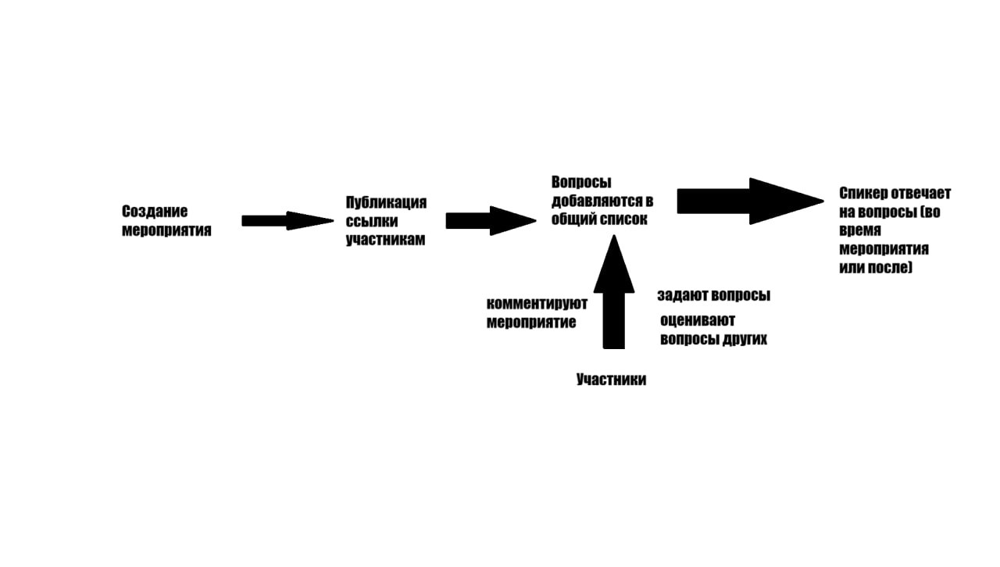

# Asky

Asky - это веб-приложение, где лекторы могут создавать мероприятия, а слушатели - заходить и задавать к нему вопросы, голосовать и получать ответы.

## О проекте

- Проект экономит время спикера, сортируя вопросы по топу и минимизирует стеснение пользователей, так как вопросы задаются анонимно
- Проект предназначен для лекторов и слушателей
- Проект полезен тем, что экономит время спикеров и убирает стеснение слушателей

## Happy Path

## Возможности

- Создание мероприятий
- Публикация ссылки/QR слушателям
- Слушатели анонимно задают вопросы
- Слушатели голосуют за понравившиеся вопросы
- Спикер отвечает на топовые вопросы во время или после лекции

## MVP

1. Регистрация лектора / модератора
2. Создание и настройка мероприятия (название)
3. Список всех мероприятий лектора
4. Окно списка вопросов
5. Создание анонимного вопроса: лайки, текст вопроса
6. Динамическая сортировка вопросов по лайкам, дате создания, отвеченным/неотвеченным, своим, по обновлению списка
7. Лектор отмечает вопросы отвеченными (галочка)
8. Вопросы висят бесконечно пока мероприятие не закончится
9. *Экспортировать вопросы с ответами
10. *Роль Модератора - помогает лектору отбирать/закрывать вопросы

## Роли

Fронт: Петя, Сейф

Бэк: Ваня, Лев

## Задачи

### Окна

- Регистрация лектора
- Список всех мероприятий лектора + Создание мероприятия
- Окно с информацией о мероприятии (ссылка, QR)
- Список вопросов о мероприятии
- *Комментарии к вопросы
